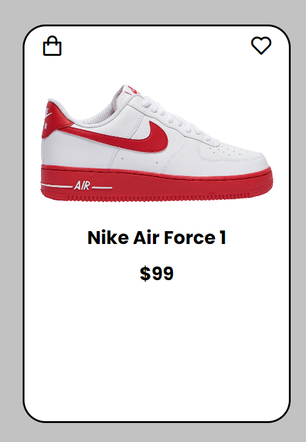
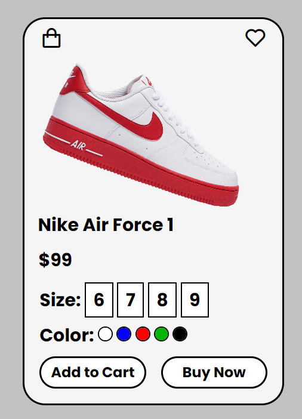

<h1> Product Card </h1>
<h2>This challege includes knowledges about relative position, abosolute position, overflow, transform, flex-box, etc.
Our goal is to make animated product card that transform when hovering it.</h2>

  
  

