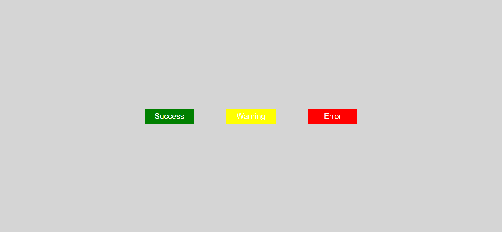
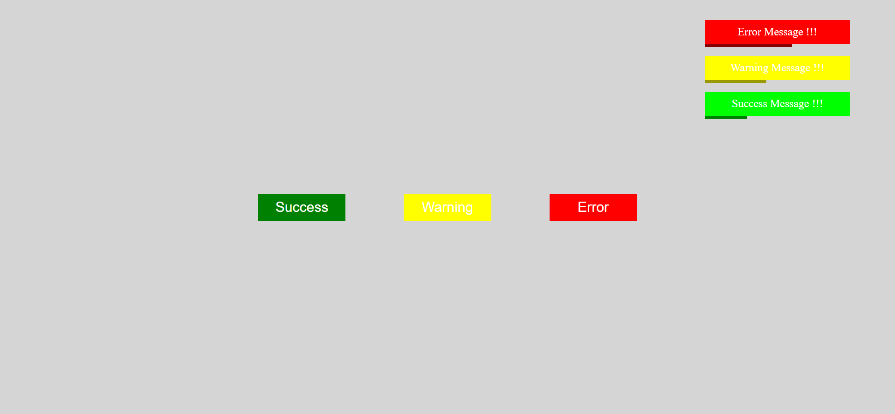

<h1> Animate Notification </h1>
<h2>This challege requires knowledges about cascading styles, parent element, classlist, before, relative position, abosolute position, createElement, prependChild, setTimeOut, animation, keyframe, etc.
The goal is to make animate notification toasts that change inner text and background color based on type of clicked button. The toast has a count down bar and slide out after a given time. </h2>

