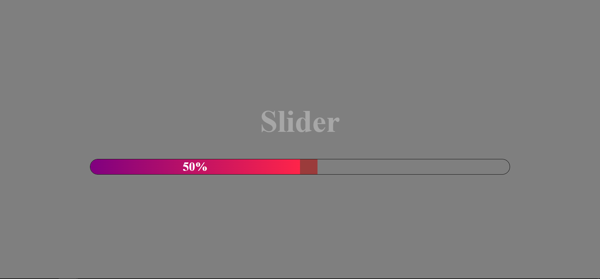
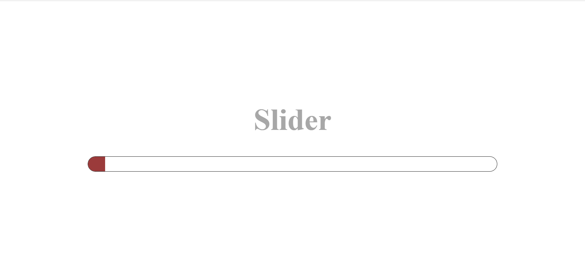

<h1> Custom Range Slidebar </h1>
<h2>This challege requires knowledges about offsetWidth, offsetLeft, pageX, mouseup, mousedown, and mousemove events, and changing style with javascript etc.
The goal is to make a slidebar that changes background color when user holds and move the thumb </h2>

