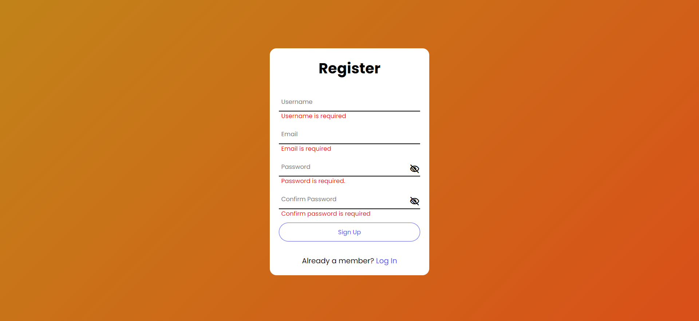
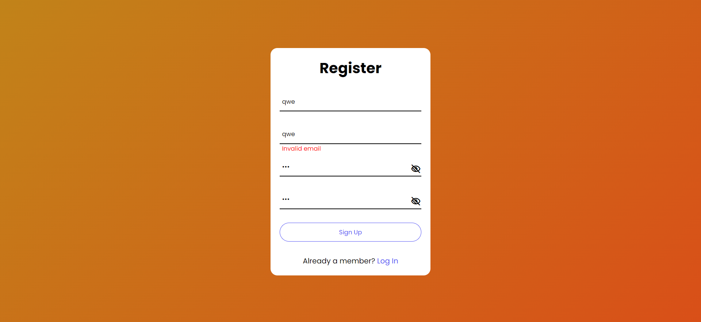
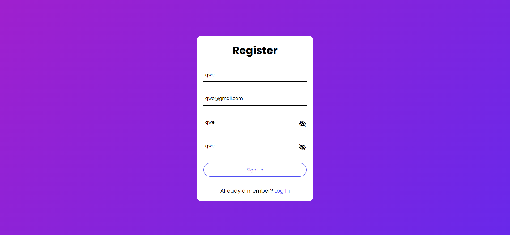

<h1> Sign Up Page </h1>
<h2>This challege requires knowledges about parent element, classlist, before, relative position, abosolute position, regEx, module program, etc.
The goal is to make a sign up form that checks empty input, valid email, matched password, and show password when user clicks show password icons.</h2>

